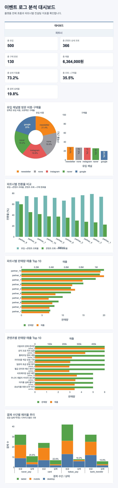
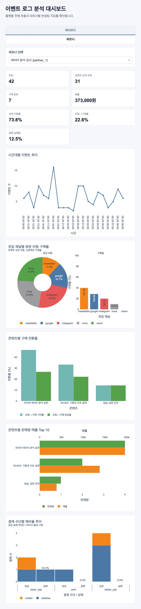
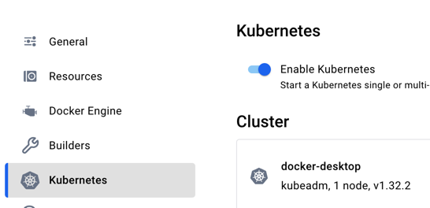
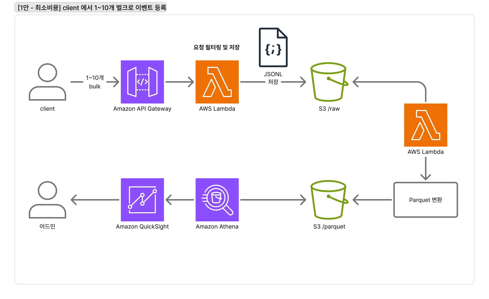
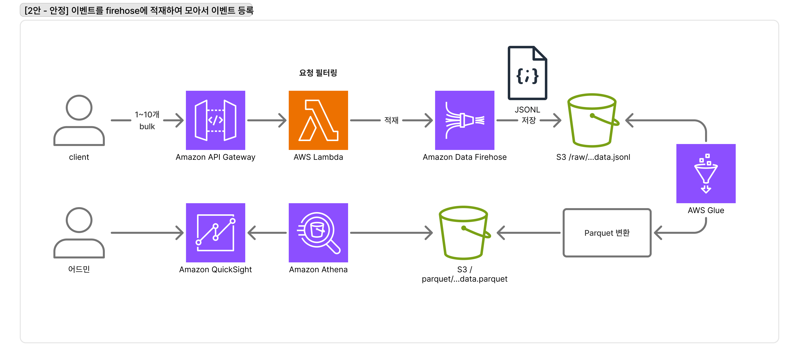

# 이벤트 로그 파이프라인 구축 및 분석
## 시나리오
이 프로젝트는 파트너(개인 강사나 창작자)가 콘텐츠를 판매하는 사이트를 운영하며, 운영 데이터를 기반으로 판매 개선 컨설팅을 제공하는 플랫폼을 가정한다.

## 기술 스택
- python
  - 이벤트 생성, 데이터 적재, 집계 분석, 시각화를 하나의 언어로 처리하기 쉽다.
  - 데이터 분석과 시각화 생태계를 활용할 수 있다.
- postgres
  - 이벤트 타입, 파트너, 시간대 기준 집계를 SQL로 작성하기 쉽다.
  - 이 프로젝트는 파트너, 이벤트 타입, 시간대처럼 명확한 기준으로 집계하는 것이 중요하므로 NoSQL보다 Postgres가 더 적합하다고 판단함.

## 요구사항 
- 이벤트 로그를 통해서 각 파트너 고객의 유입, 콘텐츠 관심도, 구매 전환, 에러를 분석해 개선 컨설팅에 활용할 수 있어야한다.
- 이벤트별 상세 속성은 properties에 저장해 이벤트 타입별로 다른 정보를 유연하게 기록할 수 있어야 한다.

## 이벤트 종류
[이벤트 디자인](./docs/EventDesign.md)
- `방문 시작` - session_start
- `유입 페이지 조회` - landing_page_view
- `콘텐츠 상세 조회` - content_view
- `구매 시작` - purchase_start
- `구매 완료` - purchase_complete
- `구매 실패` - payment_failed

## 목표
이 프로젝트로 얻고자하는 가상의 인사이트

| 분석 질문 | 필요한 이벤트 | 주요 필드 | 컨설팅 액션                                                                  |
|---|---|---|-------------------------------------------------------------------------|
| 방문자는 충분히 들어오는가? | session_start | timestamp, partner_id, session_id, device_type | 파트너별 방문 수와 방문 추이를 확인해 유입 확대가 필요한 파트너를 찾는다.                              |
| 유입 채널별 방문 비중을 확인할 수 있는가? | landing_page_view | partner_id, session_id, landing_page, referrer, utm_source, utm_campaign | 성과가 좋은 유입 채널과 캠페인을 확인해 광고 예산과 콘텐츠 홍보 채널을 조정한다.                          |
| 방문자가 콘텐츠 상세 페이지까지 이동하는가? | session_start, content_view | partner_id, session_id, content_id | 방문자의 콘텐츠 조회로 이어지는 비율을 확인해 홈, 유입 페이지, 콘텐츠 목록 등에서 콘텐츠 노출 방식과 CTA를 개선한다. |
| 콘텐츠 상세 조회가 구매로 이어지는가? | content_view, purchase_start, purchase_complete | partner_id, session_id, user_id, content_id, purchase_attempt_id, amount | 조회 대비 구매 시작률과 구매 완료율이 낮은 콘텐츠를 찾아 가격, 설명, 혜택 구성을 개선한다.                   |
| 결제에서 실패하는가? | purchase_start, purchase_complete, payment_failed | partner_id, session_id, purchase_attempt_id, payment_method, error_code, error_msg | 결제 실패율이 높은 결제 수단, 디바이스, 오류 코드를 찾아 결제 UX와 오류 대응을 개선한다.                   |

## 시각화 스크린샷
<table>
  <tr>
    <td valign="top">
      
    </td>
    <td valign="top">
      
    </td>
  </tr>
</table>

## Docker Compose 실행
```bash
docker compose up --build
```
대시보드는 브라우저에서 `http://127.0.0.1:8050`으로 확인할 수 있다.

## 로컬 실행
Postgres DB .env.example에 맞게 준비
### 실행 전 준비
```bash
python3 -m venv .venv
source .venv/bin/activate
pip install -r requirements.txt
cp .env.example .env
python3 -m src.reset_db
```

이벤트 생성기는 `contents` 시드 데이터를 기반으로 세션 단위 랜덤 이벤트를 만든다.

```text
session_start
→ landing_page_view
  → 이탈
  → content_view
    → 이탈
    → purchase_start
      → 이탈
      → purchase_complete
      → payment_failed
```

### 이벤트 생성
```bash
python3 -m src.event_generator --sessions 100 --seed 1
```

### 이벤트 저장
`--seed`를 지정하면 같은 이벤트를 다시 생성할 수 있다.
```bash
python3 -m src.event_store --sessions 100 --seed 1
```

### 결과 시각화
```bash
python3 -m src.dashboard --host 127.0.0.1 --port 8050
```

브라우저에서 `http://127.0.0.1:8050`으로 접속한다.

## 저장소 설계
스키마 파일은 [db/init.sql](./db/init.sql)에 위치  

이벤트 로그는 `events` 테이블에 저장한다.  
공통 분석 필드는 컬럼으로 분리하고, 이벤트 타입별로 달라지는 상세 값만 `properties` JSONB 컬럼에 저장한다.

### partners 테이블
가상의 파트너를 명시하기 위한 테이블  
필드는 최소한의 필드를 위해 Id, Name만 지정

| 컬럼 | 타입           | 설명        |
|---|--------------|-----------|
| partner_id | VARCHAR(50)  | 파트너 고유 ID |
| partner_name | VARCHAR(100) | 파트너 이름    |

### contents 테이블
가상의 콘텐츠를 명시하기 위한 테이블  
금액은 NUMERIC / DECIMAL 대신 INTEGER 사용 (이유 - 여기서 소수점을 사용할 생각이 없었음)

| 컬럼 | 타입           | 설명        |
|---|--------------|-----------|
| content_id | VARCHAR(50)  | 콘텐츠 고유 ID |
| partner_id | VARCHAR(50)  | 파트너 고유 ID |
| content_title | VARCHAR(100) | 콘텐츠 제목    |
| price | INTEGER  | 가격    |
| discount_amount | INTEGER  | 할인 금액 |

### events 테이블
목표에 필요하다고 생각되는 컬럼들만 추가 하였음  
현시점에서 불필요한 컬럼 없이 최대한 가볍게 가야한다고 생각함

| 컬럼 | 타입 | 설명 |
|---|---|---|
| event_id | UUID | 이벤트 고유 ID |
| event_type | VARCHAR(50) | 이벤트 종류 |
| occurred_at | TIMESTAMPTZ | 이벤트 발생 시간 |
| partner_id | VARCHAR(50) | 파트너 ID |
| user_id | VARCHAR(50), nullable | 사용자 ID |
| session_id | VARCHAR(50) | 세션 ID |
| device_type | VARCHAR(20), nullable | 디바이스 종류 |
| properties | JSONB | 이벤트별 상세 속성 |
| created_at | TIMESTAMPTZ | DB 저장 시간 |

## 구현하면서 고민한 점
- 프로젝트에서 목표 수립  
이벤트를 먼저 정한다면 그 틀에서의 인사이트 밖에 안나올거라 생각하여 목표를 먼저 세우는데  
만약 내가 플랫폼이라면, 파트너라면 "어떤 데이터가 필요하고 비교하며 개선할 수 있을까?"에서 고민을 가장 많이함

- dash 차트
막상 목표로 만든 수치들을 뽑아도 뭔가 부족한 느낌이 나고   
이것만으로는 도움이 안될 것 같아 더 괜찮은 수치를 만들기 위한 고민을 많이함

## 선택 과제 A - Kubernetes
Kubernetes manifest는 [k8s](./k8s) 디렉터리에 작성

### 로컬 테스트 방법
Docker Desktop Kubernetes를 enable


#### 실행
```bash
docker build -t data-pipeline-app:local .
kubectl apply -f k8s/
kubectl get pods
# 컨테이너 실행 확인 후
kubectl port-forward service/data-pipeline-dashboard 8050:8050
```
wait을 제외한 두 개의 컨테이너 실행이 확인 되었다면 `http://127.0.0.1:8050`에 접속 가능하다.

#### 종료
```bash
kubectl delete -f k8s/
# 컨테이너 종료 확인 후
docker rmi data-pipeline-app:local
```

### 작성한 리소스와 역할
- `configmap.yaml` - `ConfigMap`
  - 민감하지 않은 환경변수를 관리한다.
  - 생성 세션개수, dashboard port 정보 등
- `secret.yaml` - `Secret` 
  - 일반적인 위치에 노출하기 부담스러운 민감한 환경변수를 관리한다.
  - DB 커넥션 정보
- `postgres.yaml` - `Deployment & Service`
  - `Deployment`
    - selector로 지정한 app이 replicas에 설정한 개수를 유지하도록 관리한다. (app=postgres, 1개)
    - template의 도면대로 pod은 컨테이너를 실행한다.
    - secretKeyRef를 사용하여 secret의 단일 환경변수를 참조하여 사용한다. (DB_NAME, DB_USER, DB_PASSWORD)
  - `Service`
    - 요청을 pod에 전달하기 위한 경로를 잡아준다.
      - pod 죽어서 새로운 pod을 만들었는데 service가 없다면 새로 생성된 pod의 주소가 달라져서 곤란하다.
      - 로드벨런서 역할도 수행 (pod이 2개 이상일 경우 트래픽을 분산)
- `app.yaml` - `Deployment & Service`
  - `Deployment`
    - initContainers을 사용하여 pod가 실행 될 때 wait-for-postgres 컨테이너를 먼저 실행한다. (DB를 같이 배포한다는 특수성)
      - postgres가 잘 올라갔는지 확인하기 위한 컨테이너 (확인 후 컨테이너 종료)
      - 확인이 되었다면 app 컨테이너 실행한다.
    - imagePullPolicy를 Never로 줘서 혹시라도 잘못된 pull을 방지한다.
    - envFrom에서 configMapRef, secretRef를 사용하여 모든 환경변수를 불러오게한다.
  - `Service`
    - `postgres.yaml` 설명과 동일

### 리소스를 선택한 이유
- 로컬에서 테스트가 가능한 스펙으로 만들기 위해 app,DB를 같이 넣었다.
- 원격 서버에 배포한다고 가정하면 DB는 외부의 DB를 사용하게 될 것 이므로 `postgres.yaml`은 필요 없게된다. (`app.yaml`의 initContainers 또한)
- 환경변수를 이미지에 고정하지 않기 위해 `configmap.yaml`와 `scret.yaml`을 사용하였다. (DB 커넥션 정보는 민감정보라 scret을 사용했다.) 
- docker compose와 같은 스펙으로 하기위해 initContainer를 사용하여 DB가 먼저 올라온 뒤 app이 배포되게 하였다.

## 선택 과제 B - AWS
AWS 서비스에서 운영한다면 두 가지를 구상하였다.

성능 및 커버리지, 비용을 우선순위로 두고 판단하여 최종적으로 `2안`이 좋다고 판단. 

### 1안 - 최소 비용, 빠른 구축 및 변화
- API Gateway, Lambda, S3, Athena, QuickSight 채택
가장 신경쓴 부분은 `비용`으로 최소한의 비용으로 기능을 수행하며 빠르게 적용해 볼 수 있다.
#### 구조 및 각 서비스 역할 차이
- client - 1~10개 정도의 이벤트를 모아서 한번에 발송
- API Gateway - 요청을 받아 Lambda로 전달
- Lambda 
  - 이벤트 검증, 필터링 후 jsonl 형태로 만들어 raw 버킷에 저장
  - 배치 혹은 트리거로 /raw 버킷에서 jsonl을 가져와 parquet 형태로 parquet 버킷에 저장
- S3 
  - raw 버킷 - 이벤트 원본 데이터를 jsonl로 보관
  - parquet 버킷 - raw에서 조회/변환한 데이터를 parquet형태로 저장
- Athena - parquet S3 버킷에 데이터를 SQL쿼리로 조회 
- QuickSight - Athena로 만든 데이터셋을 시각화
#### 장점
- 초기비용이 적다
- 초기리소스가 적다
- 검증용으로 빠르게 만들기 좋다
#### 단점
- client에서 온 이벤트 묶음당 하나의 파일이 생성됨
- 파일이 많아지면 조회 성능에 안좋은 영향을 줄 수 있음
- 원본 데이터를 재가공해야할 때 재처리 리스크


### 2안 - 안정성 및 확장성
- API Gateway, Lambda, Firehose, S3, Glue, Athena, QuickSight 채택
안정성과 확장성을 더 중요하게 본 구조로 1안보다 비용은 조금 더 들더라도 운영에 더 유리하다고 생각
#### 구조 및 각 서비스 역할 차이
- client - 1~10개 정도의 이벤트를 모아서 한번에 발송
- API Gateway - 요청을 받아 Lambda로 전달
- Lambda - 이벤트 검증, 필터링 후 Firehose에 적재
- Firehose - 요청을 모아서 jsonl로 변환하여 raw 버킷에 저장
- S3 
  - raw 버킷 - 이벤트 원본 데이터를 jsonl로 보관
  - parquet 버킷 - raw에서 조회/변환한 데이터를 parquet형태로 저장
- Glue - 불러온 데이터에서 컬럼 추출, 타입변환, 파티션 작업 등을 수행하고 parquet형태로 변환하여 parquet 버킷에 저장  
- Athena - parquet S3 버킷에 데이터를 SQL쿼리로 조회 
- QuickSight - Athena로 만든 데이터셋을 시각화
#### 장점
- 1안보다 이벤트 파일의 물리적 개수가 적다
- 1안보다 대용량 처리에서 안정적이다
- Firehose가 버퍼링과 적재를 담당하므로 Lambda의 책임이 줄어든다
- Glue로 원본 재처리와 Parquet 변환 흐름이 명확하다
#### 단점
- 1안보다 초기비용이 크다
- 1안보다 초기리소스가 많이 든다
- 서비스가 늘어나 구조를 이해하고 관리해야 할 범위가 커진다 (관리포인트 증가)


### 설계한 아키텍처에서 가장 고민한 부분
가장 고민한 부분은 `필요한 기능 및 성능을 챙기면서 비용을 최소화할 수 있는 방법은 뭘까`였음  
시작은 최소 비용만을 생각했는데 그려보고 다시 보니 "만약 이러면?" 같은 엣지케이스가 생각나서 1안에는 한계가 있다고 생각하고  
추가적인 2안을 그림 (1안 그린게 아까워서 1,2안 분리하여 설명)

## 여담
못했거나 아쉬운 부분이 있었다면 어떤 형태로든 피드백을 받게된다면 참 좋을 것 같습니다!
